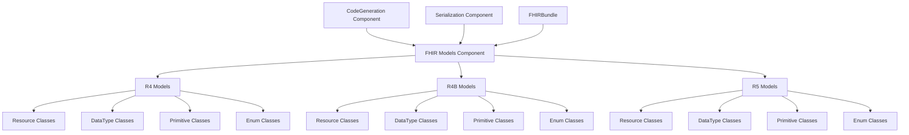

# Design Document

## Overview

The FHIR Models Component is a new standalone component that will store pre-generated FHIR model classes for R4, R4B, and R5 versions. This component leverages the existing `fhir:generate` command output to create a centralized repository of FHIR classes that can be reused across other components (CodeGeneration, Serialization, and FHIRBundle) without requiring each component to generate its own models.

The component follows the established multi-project architecture pattern and provides version-specific namespaces to prevent conflicts between different FHIR versions.

## Architecture

### Component Structure



### Directory Structure

```
src/Component/Models/
├── src/
│   ├── R4/
│   │   ├── Resource/
│   │   │   ├── FHIRPatient.php
│   │   │   ├── FHIRObservation.php
│   │   │   ├── FHIRPractitioner.php
│   │   │   ├── Patient/
│   │   │   │   ├── FHIRPatientContact.php (backbone element)
│   │   │   │   ├── FHIRPatientCommunication.php (backbone element)
│   │   │   │   └── FHIRPatientLink.php (backbone element)
│   │   │   ├── Observation/
│   │   │   │   ├── FHIRObservationReferenceRange.php (backbone element)
│   │   │   │   └── FHIRObservationComponent.php (backbone element)
│   │   │   └── ...
│   │   ├── DataType/
│   │   │   ├── FHIRHumanName.php
│   │   │   ├── FHIRAddress.php
│   │   │   ├── FHIRAdministrativeGenderType.php (code type for enum)
│   │   │   ├── FHIRObservationStatusType.php (code type for enum)
│   │   │   └── ...
│   │   ├── Primitive/
│   │   │   ├── FHIRString.php
│   │   │   ├── FHIRInteger.php
│   │   │   └── ...
│   │   └── Enum/
│   │       ├── FHIRAdministrativeGender.php
│   │       ├── FHIRObservationStatus.php
│   │       └── ...
│   ├── R4B/
│   │   ├── Resource/
│   │   │   ├── FHIRPatient.php
│   │   │   ├── FHIRObservation.php
│   │   │   ├── Patient/
│   │   │   ├── Observation/
│   │   │   └── ...
│   │   ├── DataType/
│   │   │   ├── FHIRAdministrativeGenderType.php
│   │   │   └── ...
│   │   ├── Primitive/
│   │   └── Enum/
│   │       ├── FHIRAdministrativeGender.php
│   │       └── ...
│   ├── R5/
│   │   ├── Resource/
│   │   │   ├── FHIRPatient.php
│   │   │   ├── FHIRObservation.php
│   │   │   ├── Patient/
│   │   │   ├── Observation/
│   │   │   └── ...
│   │   ├── DataType/
│   │   │   ├── FHIRAdministrativeGenderType.php
│   │   │   └── ...
│   │   ├── Primitive/
│   │   └── Enum/
│   │       ├── FHIRAdministrativeGender.php
│   │       └── ...
│   └── Utility/
│       ├── VersionDetector.php
│       └── ModelRegistry.php
├── composer.json
├── README.md
└── .gitignore
```

## Components and Interfaces

### Core Classes

#### ModelRegistry

Central registry for accessing FHIR models across versions:

```php
<?php

declare(strict_types=1);

namespace Ardenexal\FHIRTools\Component\Models\Utility;

/**
 * Central registry for FHIR model classes across versions
 */
class ModelRegistry
{
    private const SUPPORTED_VERSIONS = ['R4', 'R4B', 'R5'];
    
    private const NAMESPACE_MAP = [
        'R4' => [
            'resource' => 'Ardenexal\\FHIRTools\\Component\\Models\\R4\\Resource',
            'datatype' => 'Ardenexal\\FHIRTools\\Component\\Models\\R4\\DataType',
            'primitive' => 'Ardenexal\\FHIRTools\\Component\\Models\\R4\\Primitive',
            'enum' => 'Ardenexal\\FHIRTools\\Component\\Models\\R4\\Enum',
        ],
        'R4B' => [
            'resource' => 'Ardenexal\\FHIRTools\\Component\\Models\\R4B\\Resource',
            'datatype' => 'Ardenexal\\FHIRTools\\Component\\Models\\R4B\\DataType',
            'primitive' => 'Ardenexal\\FHIRTools\\Component\\Models\\R4B\\Primitive',
            'enum' => 'Ardenexal\\FHIRTools\\Component\\Models\\R4B\\Enum',
        ],
        'R5' => [
            'resource' => 'Ardenexal\\FHIRTools\\Component\\Models\\R5\\Resource',
            'datatype' => 'Ardenexal\\FHIRTools\\Component\\Models\\R5\\DataType',
            'primitive' => 'Ardenexal\\FHIRTools\\Component\\Models\\R5\\Primitive',
            'enum' => 'Ardenexal\\FHIRTools\\Component\\Models\\R5\\Enum',
        ],
    ];

    /**
     * Get the fully qualified class name for a FHIR resource
     */
    public static function getResourceClass(string $version, string $resourceName): string
    {
        self::validateVersion($version);
        $namespace = self::NAMESPACE_MAP[$version]['resource'];
        return "{$namespace}\\FHIR{$resourceName}";
    }

    /**
     * Get the fully qualified class name for a FHIR backbone element
     */
    public static function getBackboneElementClass(string $version, string $resourceName, string $elementName): string
    {
        self::validateVersion($version);
        $namespace = self::NAMESPACE_MAP[$version]['resource'];
        return "{$namespace}\\{$resourceName}\\FHIR{$resourceName}{$elementName}";
    }

    /**
     * Get the fully qualified class name for a FHIR data type
     */
    public static function getDataTypeClass(string $version, string $dataTypeName): string
    {
        self::validateVersion($version);
        $namespace = self::NAMESPACE_MAP[$version]['datatype'];
        return "{$namespace}\\FHIR{$dataTypeName}";
    }

    /**
     * Get the fully qualified class name for a FHIR primitive type
     */
    public static function getPrimitiveClass(string $version, string $primitiveName): string
    {
        self::validateVersion($version);
        $namespace = self::NAMESPACE_MAP[$version]['primitive'];
        return "{$namespace}\\FHIR{$primitiveName}";
    }

    /**
     * Get the fully qualified class name for a FHIR enum
     */
    public static function getEnumClass(string $version, string $enumName): string
    {
        self::validateVersion($version);
        $namespace = self::NAMESPACE_MAP[$version]['enum'];
        return "{$namespace}\\FHIR{$enumName}";
    }

    /**
     * Get the fully qualified class name for a FHIR code type (wrapper for enum)
     */
    public static function getCodeTypeClass(string $version, string $enumName): string
    {
        self::validateVersion($version);
        $namespace = self::NAMESPACE_MAP[$version]['datatype'];
        return "{$namespace}\\FHIR{$enumName}Type";
    }

    /**
     * Check if a FHIR version is supported
     */
    public static function isSupportedVersion(string $version): bool
    {
        return in_array($version, self::SUPPORTED_VERSIONS, true);
    }

    /**
     * Get all supported FHIR versions
     */
    public static function getSupportedVersions(): array
    {
        return self::SUPPORTED_VERSIONS;
    }

    private static function validateVersion(string $version): void
    {
        if (!self::isSupportedVersion($version)) {
            throw new \InvalidArgumentException(
                "Unsupported FHIR version: {$version}. Supported versions: " . 
                implode(', ', self::SUPPORTED_VERSIONS)
            );
        }
    }
}
```

#### VersionDetector

Utility for detecting FHIR versions from model instances:

```php
<?php

declare(strict_types=1);

namespace Ardenexal\FHIRTools\Component\Models\Utility;

/**
 * Utility for detecting FHIR versions from model instances
 */
class VersionDetector
{
    /**
     * Detect FHIR version from a model class instance
     */
    public static function detectVersion(object $model): ?string
    {
        $className = get_class($model);
        
        // Extract version from namespace
        if (preg_match('/\\\\Component\\\\Models\\\\(R4B?|R5)\\\\/', $className, $matches)) {
            return $matches[1];
        }
        
        return null;
    }

    /**
     * Detect FHIR version from a class name
     */
    public static function detectVersionFromClassName(string $className): ?string
    {
        if (preg_match('/\\\\Component\\\\Models\\\\(R4B?|R5)\\\\/', $className, $matches)) {
            return $matches[1];
        }
        
        return null;
    }

    /**
     * Check if a class belongs to the Models component
     */
    public static function isModelsComponentClass(string $className): bool
    {
        return str_contains($className, '\\Component\\Models\\');
    }
}
```

## Data Models

### Generated Model Classes

All model classes will be generated using the existing `fhir:generate` command with modified output paths. The classes will maintain the same structure as currently generated but will be organized in the new namespace structure.

#### Example Resource Class (FHIRPatient)

```php
<?php

declare(strict_types=1);

namespace Ardenexal\FHIRTools\Component\Models\R4B\Resource;

use Ardenexal\FHIRTools\Component\Models\R4B\DataType\FHIRHumanName;
use Ardenexal\FHIRTools\Component\Models\R4B\DataType\FHIRAddress;
use Ardenexal\FHIRTools\Component\Models\R4B\Primitive\FHIRString;
use Ardenexal\FHIRTools\Component\Models\R4B\Resource\Patient\FHIRPatientContact;
use Ardenexal\FHIRTools\Component\CodeGeneration\Attributes\FhirResource;

/**
 * FHIR Patient Resource
 * 
 * @author HL7 International
 * @see http://hl7.org/fhir/StructureDefinition/Patient
 * @description Demographics and other administrative information about an individual or animal receiving care or other health-related services.
 */
#[FhirResource(
    type: 'Patient',
    version: '4.3.0',
    url: 'http://hl7.org/fhir/StructureDefinition/Patient',
    fhirVersion: 'R4B'
)]
class FHIRPatient
{
    public function __construct(
        public readonly ?FHIRString $id = null,
        /** @var array<FHIRHumanName> $name */
        public readonly array $name = [],
        /** @var array<FHIRAddress> $address */
        public readonly array $address = [],
        /** @var array<FHIRPatientContact> $contact */
        public readonly array $contact = [],
        // ... other properties
    ) {}
}
```

#### Example Backbone Element Class (FHIRPatientContact)

```php
<?php

declare(strict_types=1);

namespace Ardenexal\FHIRTools\Component\Models\R4B\Resource\Patient;

use Ardenexal\FHIRTools\Component\Models\R4B\DataType\FHIRHumanName;
use Ardenexal\FHIRTools\Component\Models\R4B\DataType\FHIRAddress;
use Ardenexal\FHIRTools\Component\CodeGeneration\Attributes\FHIRBackboneElement;

/**
 * FHIR Patient Contact Backbone Element
 * 
 * @author HL7 International
 * @see http://hl7.org/fhir/StructureDefinition/Patient
 * @description A contact party (e.g. guardian, partner, friend) for the patient.
 */
#[FHIRBackboneElement(
    parentResource: 'Patient',
    elementPath: 'Patient.contact',
    fhirVersion: 'R4B'
)]
class FHIRPatientContact
{
    public function __construct(
        /** @var array<FHIRHumanName> $name */
        public readonly array $name = [],
        public readonly ?FHIRAddress $address = null,
        // ... other properties
    ) {}
}
```

#### Example DataType Class (FHIRHumanName)

```php
<?php

declare(strict_types=1);

namespace Ardenexal\FHIRTools\Component\Models\R4B\DataType;

use Ardenexal\FHIRTools\Component\Models\R4B\Primitive\FHIRString;
use Ardenexal\FHIRTools\Component\CodeGeneration\Attributes\FHIRComplexType;

/**
 * FHIR HumanName DataType
 * 
 * @author HL7 International
 * @see http://hl7.org/fhir/StructureDefinition/HumanName
 * @description A human's name with the ability to identify parts and usage.
 */
#[FHIRComplexType(
    typeName: 'HumanName',
    fhirVersion: 'R4B'
)]
class FHIRHumanName
{
    public function __construct(
        public readonly ?FHIRString $family = null,
        /** @var array<FHIRString> $given */
        public readonly array $given = [],
        // ... other properties
    ) {}
}
```

#### Example Enum Class (FHIRAdministrativeGender)

```php
<?php

declare(strict_types=1);

namespace Ardenexal\FHIRTools\Component\Models\R4B\Enum;

/**
 * FHIR Administrative Gender Enum
 * 
 * @author HL7 International
 * @see http://hl7.org/fhir/ValueSet/administrative-gender
 * @description The gender of a person used for administrative purposes.
 */
enum FHIRAdministrativeGender: string
{
    case MALE = 'male';
    case FEMALE = 'female';
    case OTHER = 'other';
    case UNKNOWN = 'unknown';
}
```

#### Example CodeType Class (FHIRAdministrativeGenderType)

```php
<?php

declare(strict_types=1);

namespace Ardenexal\FHIRTools\Component\Models\R4B\DataType;

use Ardenexal\FHIRTools\Component\Models\R4B\Enum\FHIRAdministrativeGender;
use Ardenexal\FHIRTools\Component\Models\R4B\Primitive\FHIRCode;

/**
 * FHIR Administrative Gender Code Type
 * 
 * @author HL7 International
 * @fhir-code-type AdministrativeGender
 * @description Code type wrapper for AdministrativeGender enum
 */
class FHIRAdministrativeGenderType extends FHIRCode
{
    public function __construct(
        /** @var FHIRAdministrativeGender|string|null $value The code value */
        public readonly FHIRAdministrativeGender|string|null $value = null
    ) {
        parent::__construct();
    }
}
```

## Correctness Properties

*A property is a characteristic or behavior that should hold true across all valid executions of a system-essentially, a formal statement about what the system should do. Properties serve as the bridge between human-readable specifications and machine-verifiable correctness guarantees.*

Let me analyze the acceptance criteria to determine which are testable as properties:

<function_calls>
<invoke name="prework">
<parameter name="featureName">fhir-models-component

## Correctness Properties

*A property is a characteristic or behavior that should hold true across all valid executions of a system-essentially, a formal statement about what the system should do. Properties serve as the bridge between human-readable specifications and machine-verifiable correctness guarantees.*

Based on the prework analysis, the following properties will be implemented:

### Property 1: Version-specific namespace isolation
*For any* FHIR version (R4, R4B, R5), all generated models should be placed in their respective version-specific namespaces without conflicts
**Validates: Requirements 1.2, 1.5, 8.1-8.6**

### Property 2: Generation process consistency
*For any* FHIR StructureDefinition processed by the existing generate-models command, the output should be compatible with the Models component namespace structure
**Validates: Requirements 2.1, 2.5**

### Property 3: Component integration compatibility
*For any* other component (CodeGeneration, Serialization, FHIRBundle) that imports models, the classes should be accessible and usable without modification
**Validates: Requirements 3.3, 4.4, 5.4**

### Property 4: Backward compatibility preservation
*For any* public interface in the Models component, updates should maintain compatibility with existing consumers
**Validates: Requirements 3.5, 5.5**

### Property 5: Code quality standards compliance
*For any* generated PHP class in the Models component, it should pass strict types, PSR-12, and PHPStan analysis
**Validates: Requirements 7.1, 7.2, 7.3**

### Property 6: Documentation completeness
*For any* public class in the Models component, it should have comprehensive PHPDoc annotations
**Validates: Requirements 7.5**

### Property 7: Namespace organization consistency
*For any* FHIR model type (Resource, DataType, Primitive, Enum), it should be placed in the correct namespace category across all versions
**Validates: Requirements 8.1-8.5**

### Property 8: Model inheritance structure preservation
*For any* FHIR model with inheritance relationships, the base class hierarchies should be correctly maintained
**Validates: Requirements 4.5, 9.4**

### Property 9: Cross-version utility functionality
*For any* version detection or registry operation, it should correctly identify and provide access to version-specific models
**Validates: Requirements 8.7**

### Property 10: Test pattern consistency
*For any* test written for the Models component, it should follow the established testing patterns used by other components
**Validates: Requirements 7.4**

## Error Handling

### Exception Types

The Models component will define specific exceptions for model-related errors:

```php
<?php

declare(strict_types=1);

namespace Ardenexal\FHIRTools\Component\Models\Exception;

use Ardenexal\FHIRTools\Exception\FHIRToolsException;

/**
 * Base exception for FHIR Models component
 */
class ModelsException extends FHIRToolsException
{
    public static function unsupportedVersion(string $version): self
    {
        return new self("Unsupported FHIR version: {$version}");
    }

    public static function modelNotFound(string $className): self
    {
        return new self("FHIR model class not found: {$className}");
    }

    public static function invalidNamespace(string $namespace): self
    {
        return new self("Invalid FHIR model namespace: {$namespace}");
    }
}
```

### Error Recovery

The component will implement graceful error handling:

1. **Version Detection Failures**: Fall back to manual version specification
2. **Missing Model Classes**: Provide clear error messages with suggestions
3. **Namespace Conflicts**: Use fully qualified class names to resolve conflicts
4. **Generation Failures**: Maintain partial functionality with available models

## Testing Strategy

### Dual Testing Approach

The Models component will use both unit tests and property-based tests:

**Unit Tests**:
- Verify specific model class structures
- Test utility class functionality
- Validate namespace organization
- Check composer package structure

**Property-Based Tests**:
- Test namespace isolation across all versions
- Verify generation consistency across all model types
- Validate cross-component integration
- Test backward compatibility preservation

### Property-Based Testing Configuration

Each property test will run a minimum of 100 iterations and be tagged with:
- **Feature: fhir-models-component, Property {number}: {property_text}**

Example property test structure:

```php
<?php

namespace Ardenexal\FHIRTools\Component\Models\Tests\Property;

use Eris\Generator;
use Eris\TestTrait;
use PHPUnit\Framework\TestCase;

class ModelsPropertyTest extends TestCase
{
    use TestTrait;

    /**
     * Feature: fhir-models-component, Property 1: Version-specific namespace isolation
     */
    public function testVersionSpecificNamespaceIsolation(): void
    {
        $this->forAll(
            Generator\elements(['R4', 'R4B', 'R5']),
            Generator\elements(['Patient', 'Observation', 'Practitioner'])
        )->then(function (string $version, string $resourceName) {
            $className = ModelRegistry::getResourceClass($version, $resourceName);
            
            // Verify the class is in the correct version namespace
            $this->assertStringContains("\\{$version}\\Resource\\", $className);
            
            // Verify no conflicts with other versions
            $otherVersions = array_diff(['R4', 'R4B', 'R5'], [$version]);
            foreach ($otherVersions as $otherVersion) {
                $otherClassName = ModelRegistry::getResourceClass($otherVersion, $resourceName);
                $this->assertNotEquals($className, $otherClassName);
            }
        });
    }
}
```

### Integration Testing

The component will include integration tests to verify:

1. **CodeGeneration Integration**: Generated models can be extended
2. **Serialization Integration**: Models can be serialized/deserialized
3. **FHIRBundle Integration**: Models are available in Symfony DI container
4. **Composer Integration**: Package can be installed and autoloaded

### Performance Testing

Performance tests will ensure:

1. **Class Loading Performance**: Models load efficiently
2. **Memory Usage**: Reasonable memory footprint
3. **Autoloading Efficiency**: PSR-4 autoloading works optimally

## Generation Process Integration

### Modified Generation Command

The existing `fhir:generate` command will be extended to support Models component output:

```php
<?php

// New command option for Models component generation
#[Option(description: 'Generate models for the Models component', name: 'models-component')]
public function generateForModelsComponent(bool $modelsComponent = false): void
{
    if ($modelsComponent) {
        $this->generateModelsComponentStructure();
    }
}

private function generateModelsComponentStructure(): void
{
    // Modify namespace generation to use Models component structure
    $baseNamespace = 'Ardenexal\\FHIRTools\\Component\\Models';
    
    foreach (['R4', 'R4B', 'R5'] as $version) {
        $this->generateVersionModels($version, $baseNamespace);
    }
}
```

### Output Path Modification

The generation process will be modified to output files to the Models component structure with backbone elements grouped by resource:

```php
<?php

private function getModelsComponentOutputPath(string $version, string $type, ?string $resourceName = null): string
{
    $basePath = __DIR__ . '/../../Models/src';
    
    $typePath = match($type) {
        'resource' => $resourceName ? "Resource/{$resourceName}" : 'Resource',
        'backbone' => $resourceName ? "Resource/{$resourceName}" : throw new \InvalidArgumentException('Resource name required for backbone elements'),
        'datatype' => 'DataType', 
        'primitive' => 'Primitive',
        'enum' => 'Enum',
        default => throw new \InvalidArgumentException("Unknown type: {$type}")
    };
    
    return "{$basePath}/{$version}/{$typePath}";
}

private function generateBackboneElement(array $structureDefinition, string $version): void
{
    // Extract parent resource from backbone element path (e.g., "Patient.contact" -> "Patient")
    $elementPath = $structureDefinition['name'];
    $pathParts = explode('.', $elementPath);
    $parentResource = $pathParts[0];
    
    // Generate backbone element in the parent resource's directory
    $outputPath = $this->getModelsComponentOutputPath($version, 'backbone', $parentResource);
    
    // Generate the backbone element class
    $class = $this->generateModelClass($structureDefinition, $version, $this->context);
    $this->outputClassToPath($class, $outputPath);
}
```

## Deployment and Distribution

### Composer Package Configuration

```json
{
    "name": "ardenexal/fhir-models",
    "description": "Pre-generated FHIR model classes for R4, R4B, and R5",
    "type": "library",
    "license": "MIT",
    "authors": [
        {
            "name": "FHIR Tools Contributors",
            "email": "contributors@fhirtools.dev"
        }
    ],
    "minimum-stability": "stable",
    "prefer-stable": true,
    "require": {
        "php": ">=8.2"
    },
    "require-dev": {
        "phpunit/phpunit": "^12.5",
        "giorgiosironi/eris": "^1.0"
    },
    "autoload": {
        "psr-4": {
            "Ardenexal\\FHIRTools\\Component\\Models\\": "src/"
        }
    },
    "autoload-dev": {
        "psr-4": {
            "Ardenexal\\FHIRTools\\Component\\Models\\Tests\\": "tests/"
        }
    },
    "scripts": {
        "test": "phpunit",
        "test-coverage": "phpunit --coverage-html coverage"
    }
}
```

### Dependency Integration

Other components will be updated to depend on the Models component:

#### FHIRBundle composer.json update:
```json
{
    "require": {
        "ardenexal/fhir-models": "^1.0",
        "ardenexal/fhir-code-generation": "^1.0",
        "ardenexal/fhir-serialization": "^1.0"
    }
}
```

#### Serialization Component composer.json update:
```json
{
    "require": {
        "ardenexal/fhir-models": "^1.0"
    }
}
```

### Backward Compatibility

To maintain backward compatibility, the root package will provide aliases:

```php
<?php

// In the root package's bootstrap file
class_alias(
    'Ardenexal\\FHIRTools\\Component\\Models\\R4B\\Resource\\FHIRPatient',
    'Ardenexal\\FHIRTools\\FHIR\\R4B\\Element\\FHIRPatient'
);
```

This ensures existing code continues to work while new code can use the improved namespace structure.
