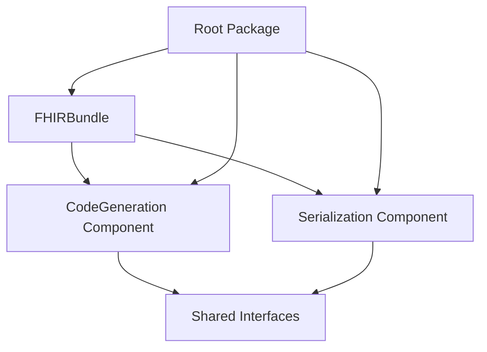

# Design Document

## Overview

This design document outlines the architectural transformation of the PHP FHIR Tools repository from a monolithic structure to a multi-project format with separate packages for Bundle, CodeGeneration, and Serialization components. The reorganization will improve modularity, enable independent versioning, and provide better separation of concerns while maintaining backward compatibility and supporting both Symfony 6.4 and 7.4.

## Architecture

The new multi-project architecture will organize the repository into distinct packages with clear boundaries and dependencies:

```
php-fhir-tools/
├── src/
│   ├── Bundle/
│   │   └── FHIRBundle/
│   │       ├── FHIRBundle.php
│   │       ├── DependencyInjection/
│   │       ├── Resources/
│   │       │   └── config/
│   │       │       └── services.yaml
│   │       ├── composer.json
│   │       └── README.md
│   ├── Component/
│   │   ├── CodeGeneration/
│   │   │   ├── src/
│   │   │   ├── composer.json
│   │   │   └── README.md
│   │   └── Serialization/
│   │       ├── src/
│   │       ├── composer.json
│   │       └── README.md
│   └── (legacy files for backward compatibility)
├── docs/
│   ├── architecture.md
│   ├── migration-guide.md
│   └── component-guides/
├── config/
│   └── recipes/
│       └── fhir-bundle/
└── composer.json (root package)
```

### Package Dependencies



## Components and Interfaces

### 1. FHIRBundle Package

**Location**: `src/Bundle/FHIRBundle/`

**Purpose**: Symfony Bundle that provides FHIR services integration and configuration

**Key Classes**:
- `FHIRBundle`: Main bundle class extending Symfony Bundle
- `FHIRExtension`: Configuration extension for semantic config
- `FHIRBundleConfiguration`: Configuration tree builder
- `FHIRCompilerPass`: Service container compiler passes

**Services Configuration**:
```yaml
# Resources/config/services.yaml
services:
    _defaults:
        autowire: true
        autoconfigure: true
        public: false

    Ardenexal\FHIRTools\Bundle\FHIRBundle\:
        resource: '../src/'
        exclude:
            - '../src/DependencyInjection/'
            - '../src/Resources/'

    # FHIR Generation Services
    fhir.model_generator:
        class: Ardenexal\FHIRTools\Component\CodeGeneration\FHIRModelGenerator
        public: true

    # FHIR Serialization Services  
    fhir.serialization_service:
        class: Ardenexal\FHIRTools\Component\Serialization\FHIRSerializationService
        public: true
```

### 2. CodeGeneration Component

**Location**: `src/Component/CodeGeneration/`

**Purpose**: Standalone package for generating PHP classes from FHIR definitions

**Key Classes**:
- `FHIRModelGenerator`: Main generator service
- `FHIRValueSetGenerator`: Value set to enum generator
- `BuilderContext`: Generation context manager
- `PackageLoader`: FHIR package management
- `ErrorCollector`: Error aggregation and reporting

**Package Structure**:
```
CodeGeneration/
├── src/
│   ├── Generator/
│   ├── Package/
│   ├── Exception/
│   ├── Command/
│   └── Interfaces/
├── tests/
├── composer.json
└── README.md
```

### 3. Serialization Component

**Location**: `src/Component/Serialization/`

**Purpose**: Standalone package for FHIR JSON serialization and validation

**Key Classes**:
- `FHIRSerializationService`: Main serialization service
- `FHIRResourceNormalizer`: Resource normalization
- `FHIRTypeResolver`: Type resolution for serialization
- `FHIRValidator`: FHIR validation capabilities
- `FHIRMetadataExtractor`: Metadata extraction from FHIR classes

**Package Structure**:
```
Serialization/
├── src/
│   ├── Normalizer/
│   ├── Validator/
│   ├── Context/
│   ├── Exception/
│   └── Interfaces/
├── tests/
├── composer.json
└── README.md
```

## Data Models

### Package Configuration

```php
// Bundle composer.json
{
    "name": "ardenexal/fhir-bundle",
    "type": "symfony-bundle",
    "require": {
        "php": ">=8.3",
        "symfony/framework-bundle": "^6.4|^7.4",
        "ardenexal/fhir-code-generation": "^1.0",
        "ardenexal/fhir-serialization": "^1.0"
    }
}

// CodeGeneration composer.json
{
    "name": "ardenexal/fhir-code-generation",
    "type": "library",
    "require": {
        "php": ">=8.3",
        "nette/php-generator": "^4.2.0",
        "composer/semver": "^3.4.4"
    }
}

// Serialization composer.json
{
    "name": "ardenexal/fhir-serialization",
    "type": "library",
    "require": {
        "php": ">=8.3",
        "symfony/serializer": "^6.4|^7.4",
        "symfony/validator": "^6.4|^7.4"
    }
}
```

### Bundle Configuration Schema

```php
class FHIRBundleConfiguration implements ConfigurationInterface
{
    public function getConfigTreeBuilder(): TreeBuilder
    {
        $treeBuilder = new TreeBuilder('fhir');
        $rootNode = $treeBuilder->getRootNode();

        $rootNode
            ->children()
                ->arrayNode('generation')
                    ->children()
                        ->scalarNode('output_directory')->defaultValue('%kernel.project_dir%/src/FHIR')->end()
                        ->scalarNode('base_namespace')->defaultValue('App\\FHIR')->end()
                        ->booleanNode('generate_tests')->defaultFalse()->end()
                    ->end()
                ->end()
                ->arrayNode('serialization')
                    ->children()
                        ->booleanNode('strict_validation')->defaultTrue()->end()
                        ->booleanNode('cache_metadata')->defaultTrue()->end()
                    ->end()
                ->end()
            ->end();

        return $treeBuilder;
    }
}
```

### Migration Strategy

```php
class BackwardCompatibilityLayer
{
    // Provide class aliases for existing code
    public static function registerAliases(): void
    {
        class_alias(
            'Ardenexal\\FHIRTools\\Component\\CodeGeneration\\FHIRModelGenerator',
            'Ardenexal\\FHIRTools\\FHIRModelGenerator'
        );
        
        class_alias(
            'Ardenexal\\FHIRTools\\Component\\Serialization\\FHIRSerializationService',
            'Ardenexal\\FHIRTools\\Serialization\\FHIRSerializationService'
        );
    }
}
```

## Correctness Properties

*A property is a characteristic or behavior that should hold true across all valid executions of a system-essentially, a formal statement about what the system should do. Properties serve as the bridge between human-readable specifications and machine-verifiable correctness guarantees.*

### Multi-Project Structure Properties

**Property 1: Component composer.json validity**
*For any* component package (Bundle, CodeGeneration, Serialization), the composer.json file should be valid and contain all required package definition fields
**Validates: Requirements 1.2**

**Property 2: Dependency separation**
*For any* component package, there should be no circular dependencies between components
**Validates: Requirements 1.3**

**Property 3: Explicit dependency declaration**
*For any* inter-component dependency, it should be explicitly declared in the dependent component's composer.json
**Validates: Requirements 1.4**

**Property 4: PSR-4 namespace compliance**
*For any* class in the reorganized structure, it should follow PSR-4 autoloading standards with correct namespace-to-directory mapping
**Validates: Requirements 1.5**

### Symfony Bundle Properties

**Property 5: Bundle service registration**
*For any* FHIR service defined in the bundle, it should be properly registered in the Symfony service container
**Validates: Requirements 2.3**

**Property 6: Service container accessibility**
*For any* FHIR service exposed by the bundle, it should be retrievable from the Symfony service container
**Validates: Requirements 2.4**

**Property 7: Configuration schema validation**
*For any* bundle configuration provided, it should validate against the defined configuration schema
**Validates: Requirements 2.5**

### Cross-Compatibility Properties

**Property 8: Symfony 6.4 compatibility**
*For any* component functionality, it should work correctly when used with Symfony 6.4
**Validates: Requirements 3.1**

**Property 9: Symfony 7.4 compatibility**
*For any* component functionality, it should work correctly when used with Symfony 7.4
**Validates: Requirements 3.2**

**Property 10: Version range validity**
*For any* Symfony dependency declared in composer.json, the version range should support both 6.4 and 7.4
**Validates: Requirements 3.3**

**Property 11: Configuration compatibility**
*For any* bundle configuration syntax used, it should be compatible with both Symfony 6.4 and 7.4
**Validates: Requirements 3.4**

**Property 12: Deprecation handling**
*For any* deprecated Symfony feature used, the system should handle it gracefully across supported versions
**Validates: Requirements 3.5**

### Migration and Backward Compatibility Properties

**Property 13: Functional preservation**
*For any* existing functionality, it should continue to work after the repository reorganization
**Validates: Requirements 6.1**

**Property 14: Namespace backward compatibility**
*For any* existing class reference using old namespaces, it should still resolve correctly through compatibility aliases
**Validates: Requirements 6.2**

**Property 15: Import resolution**
*For any* import statement in the codebase, it should resolve to the correct class after reorganization
**Validates: Requirements 6.3**

**Property 16: Test preservation**
*For any* existing test, it should continue to pass after the repository reorganization
**Validates: Requirements 6.4**

**Property 17: Build process preservation**
*For any* existing build or deployment process, it should continue to work after reorganization
**Validates: Requirements 6.5**

### Component Independence Properties

**Property 18: CodeGeneration independence**
*For any* code generation functionality, it should work when the CodeGeneration component is installed independently
**Validates: Requirements 7.2**

**Property 19: CodeGeneration dependency minimization**
*For any* dependency declared by the CodeGeneration component, it should be necessary for the component's functionality
**Validates: Requirements 7.3**

**Property 20: CodeGeneration test coverage**
*For any* CodeGeneration component functionality, it should have adequate test coverage
**Validates: Requirements 7.4**

**Property 21: Serialization independence**
*For any* serialization functionality, it should work when the Serialization component is installed independently
**Validates: Requirements 8.2**

**Property 22: Serialization Symfony integration**
*For any* Serialization component usage with Symfony Serializer, the integration should work seamlessly
**Validates: Requirements 8.3**

**Property 23: Serialization validation capabilities**
*For any* FHIR validation operation, the Serialization component should provide complete validation functionality
**Validates: Requirements 8.4**

**Property 24: Serialization performance**
*For any* large FHIR document processing, the Serialization component should maintain acceptable performance
**Validates: Requirements 8.5**

## Error Handling

The reorganized system will maintain robust error handling across all components:

### Component-Level Error Handling
- **Package Loading Errors**: Clear error messages when components fail to load
- **Dependency Resolution Errors**: Detailed information about missing or incompatible dependencies
- **Configuration Errors**: Validation errors with specific guidance for bundle configuration
- **Migration Errors**: Comprehensive error reporting during the reorganization process

### Cross-Component Error Propagation
- **Service Registration Failures**: Bundle should handle component service registration failures gracefully
- **Interface Compatibility**: Clear error messages when component interfaces are incompatible
- **Version Conflicts**: Detailed reporting of Symfony version compatibility issues

## Testing Strategy

The testing approach will ensure comprehensive coverage across the multi-project structure:

### Unit Testing
- **Component Isolation**: Test each component independently with mocked dependencies
- **Bundle Integration**: Test bundle service registration and configuration
- **Backward Compatibility**: Test that existing code continues to work with compatibility layers
- **Cross-Version Testing**: Test components against both Symfony 6.4 and 7.4

### Integration Testing
- **Multi-Component Workflows**: Test complete workflows that span multiple components
- **Bundle Installation**: Test Symfony Flex recipe installation and configuration
- **Migration Testing**: Test the migration process from old to new structure
- **Performance Testing**: Ensure reorganization doesn't impact performance

### Property-Based Testing
- **Universal Properties**: Test properties that should hold across all components using **PHPUnit with Eris**
- **Configuration Validation**: Generate random configurations and test validation
- **Dependency Resolution**: Test dependency resolution with various package combinations
- **Namespace Resolution**: Test PSR-4 compliance across different namespace configurations

### Testing Framework Requirements
- Use **PHPUnit 12+** as the primary testing framework
- Integrate **Eris** for property-based testing capabilities
- **Minimum 100 iterations** for each property-based test
- **Test tagging** with explicit references to design document properties using format: `**Feature: repository-reorganization, Property {number}: {property_text}**`
- Test against both Symfony 6.4 and 7.4 in CI/CD pipeline

## Symfony Flex Recipe Design

The bundle will include a Symfony Flex recipe for automatic configuration:

### Recipe Structure
```
config/recipes/fhir-bundle/
├── 1.0/
│   ├── manifest.json
│   ├── config/
│   │   └── packages/
│   │       └── fhir.yaml
│   └── src/
│       └── FHIR/
│           └── .gitkeep
```

### Manifest Configuration
```json
{
    "bundles": {
        "Ardenexal\\FHIRTools\\Bundle\\FHIRBundle\\FHIRBundle": ["all"]
    },
    "copy-from-recipe": {
        "config/": "%CONFIG_DIR%/",
        "src/": "%SRC_DIR%/"
    },
    "env": {
        "FHIR_OUTPUT_DIR": "%kernel.project_dir%/src/FHIR",
        "FHIR_BASE_NAMESPACE": "App\\FHIR"
    }
}
```

### Default Configuration
```yaml
# config/packages/fhir.yaml
fhir:
    generation:
        output_directory: '%env(FHIR_OUTPUT_DIR)%'
        base_namespace: '%env(FHIR_BASE_NAMESPACE)%'
        generate_tests: false
    serialization:
        strict_validation: true
        cache_metadata: true
```

## Migration Guide

### Phase 1: Structure Creation
1. Create new directory structure for components
2. Set up composer.json files for each component
3. Create bundle structure with proper Symfony conventions

### Phase 2: Code Migration
1. Move existing code to appropriate components
2. Update namespaces and imports
3. Create backward compatibility aliases
4. Update service configurations

### Phase 3: Testing and Validation
1. Migrate existing tests to new structure
2. Add component-specific tests
3. Validate cross-component integration
4. Test Symfony Flex recipe installation

### Phase 4: Documentation Update
1. Update AGENTS.md with new structure
2. Create component README files
3. Update steering documents
4. Create migration documentation in /docs folder

## Performance Considerations

### Component Loading
- **Lazy Loading**: Components should only load when needed
- **Service Registration**: Minimize overhead during bundle registration
- **Autoloading**: Optimize PSR-4 autoloading paths

### Memory Usage
- **Component Isolation**: Prevent memory leaks between components
- **Service Sharing**: Share common services efficiently across components
- **Configuration Caching**: Cache bundle configuration for performance

### Build Performance
- **Parallel Testing**: Enable parallel test execution across components
- **Incremental Builds**: Support incremental builds for individual components
- **Dependency Optimization**: Minimize dependency resolution overhead

<function_calls>
<invoke name="prework">
<parameter name="featureName">repository-reorganization