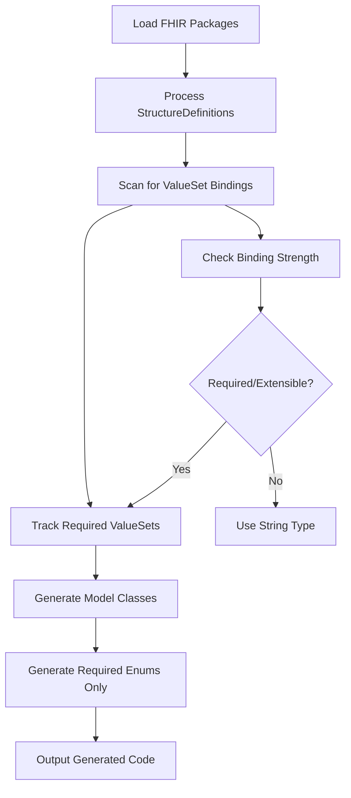

# Design Document

## Overview

The selective enum generation feature optimizes FHIR code generation by producing only the enums that are actually required by StructureDefinitions, rather than generating all available ValueSet enums. This reduces code bloat, improves compilation performance, and creates more maintainable generated code.

The current system processes all ValueSets and applies basic filtering (size limits, known large code systems), but it doesn't track which ValueSets are actually referenced by StructureDefinitions through binding elements. This design implements proper dependency tracking to generate only the minimal required set of enums.

## Architecture

The selective generation system follows a two-phase approach:

1. **Dependency Discovery Phase**: Scan all StructureDefinitions to identify ValueSet bindings and track required enums
2. **Selective Generation Phase**: Generate enums only for tracked dependencies, skipping unreferenced ValueSets



## Components and Interfaces

### Enhanced BuilderContextInterface

The `BuilderContextInterface` needs to be updated to properly expose pending enum and type management methods:

```php
interface BuilderContextInterface
{
    // Existing methods...
    
    /**
     * Add a pending enum for generation
     */
    public function addPendingEnum(string $url, string $enumName): void;
    
    /**
     * Get all pending enums
     */
    public function getPendingEnums(): array;
    
    /**
     * Remove a pending enum after generation
     */
    public function removePendingEnum(string $url): void;
    
    /**
     * Add a pending type for generation
     */
    public function addPendingType(string $url, string $typeClassName): void;
    
    /**
     * Get all pending types
     */
    public function getPendingTypes(): array;
    
    /**
     * Check if a type is pending generation
     */
    public function hasPendingType(string $url): bool;
    
    /**
     * Remove a pending type after generation
     */
    public function removePendingType(string $url): void;
}
```


### Enhanced FHIRModelGenerator

The model generator will be updated to track ValueSet dependencies during element processing by directly interacting with the BuilderContext. When enums are generated, the existing `generateModelCodeType` method will be used to create corresponding code type classes:

```php
class FHIRModelGenerator
{
    // Enhanced method to track ValueSet dependencies and add pending enums
    private function addElementAsProperty(
        array $element, 
        Method $method, 
        string $version, 
        BuilderContextInterface $builderContext, 
        ?EnumType $enum = null
    ): void;
    
    // Helper method to determine if binding should generate enum (only required strength)
    private function shouldGenerateEnumForBinding(string $bindingStrength): bool;
    
    // Existing method that will be used to create code types for generated enums
    public function generateModelCodeType(
        EnumType $enumType,
        string $version,
        BuilderContextInterface $builderContext
    ): ClassType;
}
```

### Enhanced Command Logic

The `FHIRModelGeneratorCommand` will be updated to remove the current `processValueSets` method that processes all ValueSets upfront. Instead, the dependency tracking will happen during StructureDefinition processing in the `FHIRModelGenerator`.
```

## Data Models

### Dependency Tracking Data

The BuilderContext maintains several collections for dependency tracking:

```php
class BuilderContext
{
    /** @var array<string, string> Pending enums keyed by ValueSet URL */
    private array $pendingEnums = [];
    
    /** @var array<string, string> Pending types keyed by ValueSet URL */
    private array $pendingTypes = [];
    
    /** @var array<string, array> ValueSet binding metadata */
    private array $bindingMetadata = [];
    
    /** @var array<string, int> Generation metrics */
    private array $generationMetrics = [];
}
```

### Binding Metadata Structure

```php
/**
 * @phpstan-type BindingMetadata array{
 *     valueSetUrl: string,
 *     strength: string,
 *     elementPath: string,
 *     structureDefinitionUrl: string,
 *     required: bool
 * }
 */
```

## Correctness Properties

*A property is a characteristic or behavior that should hold true across all valid executions of a system-essentially, a formal statement about what the system should do. Properties serve as the bridge between human-readable specifications and machine-verifiable correctness guarantees.*

Based on the prework analysis, I need to perform property reflection to eliminate redundancy before writing the correctness properties.

**Property Reflection:**

Looking at the prework analysis, I can identify several areas where properties can be combined or where redundancy exists:

1. **Binding Strength Properties (2.1, 2.2 vs 2.3, 2.4)**: Properties 2.1 and 2.2 both test strong bindings (required/extensible) generating enums, while 2.3 and 2.4 test weak bindings (preferred/example) using strings. These can be combined into two comprehensive properties.

2. **Selective Generation Properties (1.3, 1.4, 1.5)**: Properties 1.3, 1.4, and 1.5 all test the core selective generation behavior from different angles. They can be combined into one comprehensive property about generating exactly the required set.

3. **Nested Dependency Properties (6.1, 6.2, 6.3)**: Properties 6.1, 6.2, and 6.3 all test recursive dependency tracking in different contexts. They can be combined into one property about comprehensive nested tracking.

4. **Metrics Properties (7.1, 7.2, 7.3)**: These properties all test different aspects of metrics collection and can be combined into one property about accurate metrics tracking.

5. **Logging Properties (8.1, 8.2, 8.3, 8.4, 8.5)**: These properties all test logging behavior and can be combined into fewer comprehensive logging properties.

After reflection, here are the essential correctness properties:

## Correctness Properties

**Property 1: Selective enum generation**
*For any* set of StructureDefinitions and ValueSets, the system should generate enums only for ValueSets that are referenced by bindings in the StructureDefinitions, producing exactly the minimal required set
**Validates: Requirements 1.1, 1.2, 1.3, 1.4, 1.5**

**Property 2: Binding strength determines generation**
*For any* binding with required strength, the system should generate an enum for the referenced ValueSet, while bindings with extensible, preferred, or example strength should use string types without generating enums
**Validates: Requirements 2.1, 2.2, 2.3, 2.4**

**Property 3: Default binding strength handling**
*For any* binding without specified strength, the system should treat it as extensible and use string type without generating an enum
**Validates: Requirements 2.5**

**Property 4: ValueSet resolution with fallback**
*For any* ValueSet URL reference, the system should resolve the definition from loaded packages, attempt dependency resolution if not found, and fall back to string type with warning if resolution fails completely
**Validates: Requirements 4.1, 4.2, 4.3**

**Property 5: Versioned ValueSet handling**
*For any* versioned ValueSet URL, the system should correctly parse and resolve the version-specific definition
**Validates: Requirements 4.4**

**Property 6: ValueSet caching consistency**
*For any* ValueSet that is resolved multiple times, the system should return the same cached definition on subsequent resolutions
**Validates: Requirements 4.5**

**Property 7: Enum and code type pairing**
*For any* enum generated from a ValueSet, the system should generate exactly one corresponding code type class using `generateModelCodeType` with proper inheritance and constructor parameters
**Validates: Requirements 5.1, 5.2, 5.3**

**Property 8: Code type documentation completeness**
*For any* generated code type class, the documentation should include references to the source ValueSet and proper type hints for properties
**Validates: Requirements 5.4, 5.5**

**Property 9: Recursive dependency tracking**
*For any* StructureDefinition with nested elements (backbone elements, complex types, choice elements, extensions), the system should track ValueSet dependencies at all nesting levels
**Validates: Requirements 6.1, 6.2, 6.3, 6.4, 6.5**

**Property 10: Generation metrics accuracy**
*For any* generation process, the system should accurately count and report total available ValueSets, required ValueSets identified, and enums generated
**Validates: Requirements 7.1, 7.2, 7.3**

**Property 11: Performance metrics collection**
*For any* generation process with metrics enabled, the system should measure and report time and memory differences between selective and non-selective generation
**Validates: Requirements 7.5**

**Property 12: Comprehensive logging**
*For any* generation process with appropriate logging levels, the system should log binding discoveries, resolution results, generation decisions, and detailed debug information when requested
**Validates: Requirements 7.4, 8.1, 8.2, 8.3, 8.4, 8.5**

## Error Handling

The selective enum generation system implements comprehensive error handling at multiple levels:

### ValueSet Resolution Errors
- **Missing ValueSets**: When a referenced ValueSet cannot be found, log a warning and fall back to string type
- **Invalid URLs**: Handle malformed ValueSet URLs gracefully with appropriate error messages
- **Version Conflicts**: Detect and report when multiple versions of the same ValueSet are referenced

### Dependency Tracking Errors
- **Circular Dependencies**: Detect and handle circular references between ValueSets and StructureDefinitions
- **Invalid Bindings**: Handle malformed binding definitions with detailed error context
- **Missing Binding Strength**: Apply default extensible strength when not specified

### Generation Errors
- **Enum Generation Failures**: Continue processing other ValueSets when individual enum generation fails
- **Code Type Generation Failures**: Handle failures in code type generation independently from enum generation
- **File System Errors**: Provide clear error messages for file writing and directory creation issues

### Interface Contract Errors
- **Missing Methods**: Ensure BuilderContextInterface implementations provide all required methods
- **Type Safety**: Maintain strict type checking for all pending enum and type operations
- **State Consistency**: Validate BuilderContext state consistency throughout the generation process

## Testing Strategy

The selective enum generation feature requires both unit testing and property-based testing approaches:

### Unit Testing Approach
Unit tests will cover:
- Individual component behavior (ValueSetDependencyTracker, SelectiveValueSetProcessor)
- Interface contract compliance (BuilderContextInterface implementations)
- Error handling scenarios (missing ValueSets, invalid bindings)
- Edge cases (empty StructureDefinitions, malformed URLs)

### Property-Based Testing Approach
Property-based tests will use **PHPUnit with Eris** as the property-based testing library. Each property-based test will run a minimum of 100 iterations to ensure comprehensive coverage of the input space.

Property-based tests will verify:
- **Property 1**: Generate random StructureDefinitions with various binding configurations and verify selective generation
- **Property 2**: Test binding strength classification across all possible strength values
- **Property 3**: Verify default behavior with randomly generated bindings missing strength
- **Property 4-6**: Test ValueSet resolution with various URL formats and package configurations
- **Property 7-8**: Verify enum/code type pairing and documentation with random ValueSet definitions
- **Property 9**: Test recursive dependency tracking with randomly nested StructureDefinitions
- **Property 10-12**: Verify metrics and logging with various generation scenarios

Each property-based test will be tagged with comments explicitly referencing the correctness property:
- Format: `**Feature: selective-enum-generation, Property {number}: {property_text}**`
- Example: `**Feature: selective-enum-generation, Property 1: Selective enum generation**`

### Test Data Generators
Smart generators will be created to constrain the input space intelligently:
- **StructureDefinition Generator**: Creates valid FHIR StructureDefinitions with realistic binding configurations
- **ValueSet Generator**: Generates FHIR ValueSets with various sizes and complexity levels
- **Binding Generator**: Creates binding elements with different strengths and URL formats
- **Package Generator**: Simulates FHIR package structures with dependencies

The testing strategy ensures that both specific examples (unit tests) and general correctness (property tests) are thoroughly validated, providing comprehensive coverage of the selective enum generation functionality.