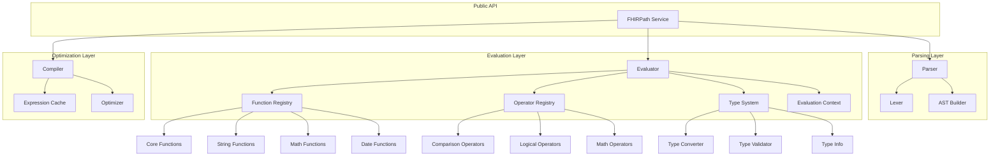
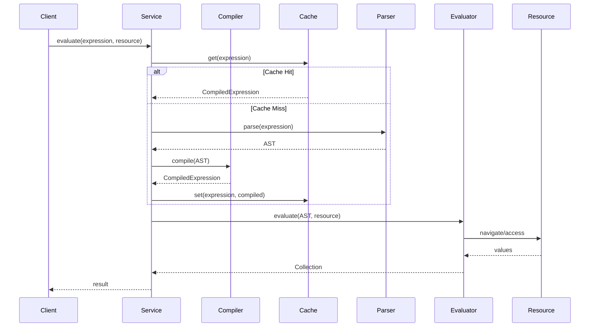
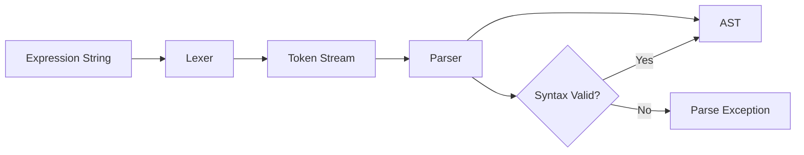
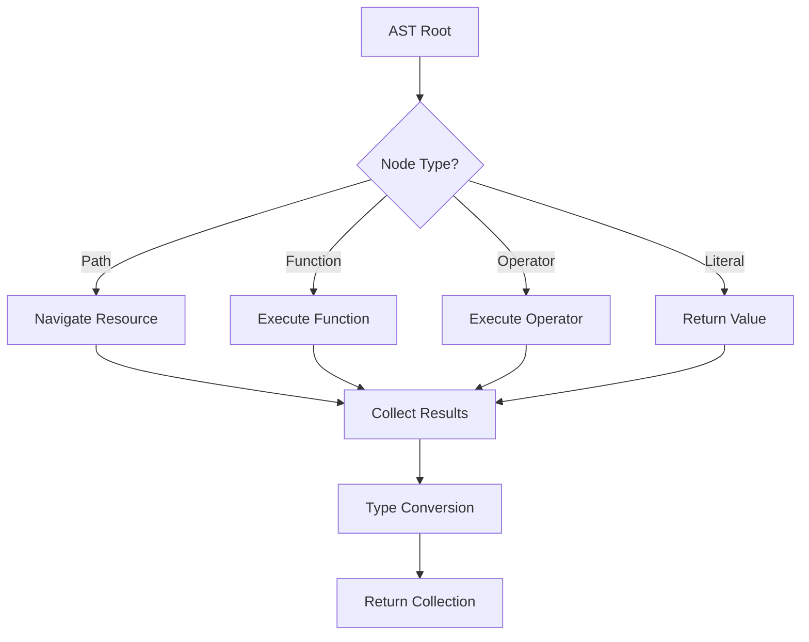
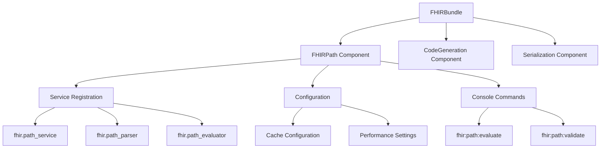
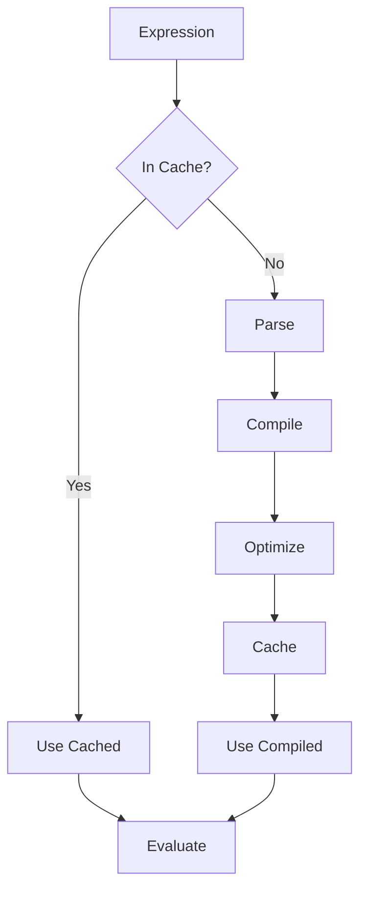

# FHIRPath Component Architecture

## Component Overview

The FHIRPath component is designed as a standalone library that can be used independently or integrated with the FHIRBundle. It follows the established multi-component architecture of PHP FHIRTools.

## Architecture Diagram



## Layer Responsibilities

### 1. Public API Layer

**FHIRPathService**
- Entry point for all FHIRPath operations
- Simple, intuitive interface
- Error handling and reporting
- Thread-safe operation

```php
interface FHIRPathServiceInterface
{
    public function evaluate(string $expression, mixed $resource): Collection;
    public function compile(string $expression): CompiledExpression;
    public function validate(string $expression): ValidationResult;
}
```

### 2. Parsing Layer

**Responsibilities**:
- Tokenize FHIRPath expressions (Lexer)
- Parse tokens into AST (Parser)
- Syntax validation
- Error reporting with position information

**Key Components**:

#### Lexer
```php
class FHIRPathLexer
{
    public function tokenize(string $expression): array;
    public function getNextToken(): ?Token;
    public function peek(): ?Token;
}
```

#### Parser
```php
class FHIRPathParser
{
    public function parse(array $tokens): ExpressionNode;
    private function parseExpression(): ExpressionNode;
    private function parseTerm(): ExpressionNode;
    private function parseFactor(): ExpressionNode;
}
```

#### AST Nodes
```php
abstract class ExpressionNode
{
    abstract public function accept(NodeVisitor $visitor);
}

class LiteralNode extends ExpressionNode { }
class PathNode extends ExpressionNode { }
class FunctionNode extends ExpressionNode { }
class OperatorNode extends ExpressionNode { }
class InvocationNode extends ExpressionNode { }
```

### 3. Evaluation Layer

**Responsibilities**:
- Execute parsed expressions
- Navigate FHIR resources
- Apply functions and operators
- Type checking and conversion
- Collection handling

**Key Components**:

#### Evaluator
```php
class FHIRPathEvaluator
{
    public function evaluate(ExpressionNode $expression, EvaluationContext $context): Collection;
    private function evaluatePath(PathNode $node, Collection $input): Collection;
    private function evaluateFunction(FunctionNode $node, Collection $input): Collection;
    private function evaluateOperator(OperatorNode $node, Collection $left, Collection $right): Collection;
}
```

#### Evaluation Context
```php
class EvaluationContext
{
    private mixed $rootResource;
    private mixed $currentResource;
    private array $variables;
    
    public function navigate(string $path): mixed;
    public function setVariable(string $name, mixed $value): void;
    public function getVariable(string $name): mixed;
}
```

#### Collection
```php
class Collection implements \IteratorAggregate, \Countable
{
    public function isEmpty(): bool;
    public function isSingle(): bool;
    public function first(): mixed;
    public function map(callable $fn): Collection;
    public function filter(callable $fn): Collection;
    public function union(Collection $other): Collection;
}
```

### 4. Function System

**Responsibilities**:
- Register and manage functions
- Validate function calls
- Execute functions

**Architecture**:

```php
interface FunctionInterface
{
    public function getName(): string;
    public function getParameterTypes(): array;
    public function getReturnType(): string;
    public function execute(Collection $input, array $parameters, EvaluationContext $context): Collection;
}

class FunctionRegistry
{
    private array $functions = [];
    
    public function register(FunctionInterface $function): void;
    public function get(string $name): ?FunctionInterface;
    public function has(string $name): bool;
}
```

**Function Categories**:
- Core/Existence Functions
- Filtering and Projection Functions
- String Manipulation Functions
- Mathematical Functions
- Date/Time Functions
- Type Conversion Functions
- Aggregate Functions

### 5. Operator System

**Responsibilities**:
- Register and manage operators
- Handle operator precedence
- Execute operators

**Architecture**:

```php
interface OperatorInterface
{
    public function getSymbol(): string;
    public function getPrecedence(): int;
    public function isLeftAssociative(): bool;
    public function execute(Collection $left, Collection $right, EvaluationContext $context): Collection;
}

class OperatorRegistry
{
    private array $operators = [];
    
    public function register(OperatorInterface $operator): void;
    public function get(string $symbol): ?OperatorInterface;
    public function getPrecedence(string $symbol): int;
}
```

**Operator Precedence Table**:
```
Precedence  Operators           Associativity
----------  ---------           -------------
1           . []                Left
2           unary - +           Right
3           * / div mod         Left
4           + - &               Left
5           |                   Left
6           > < >= <=           Left
7           is as               Left
8           = ~ != !~           Left
9           in contains         Left
10          and                 Left
11          or xor              Left
12          implies             Right
```

### 6. Type System

**Responsibilities**:
- Type hierarchy management
- Type checking and validation
- Type conversion
- FHIR type mapping

**Architecture**:

```php
class FHIRPathTypeSystem
{
    public function isCompatible(string $fromType, string $toType): bool;
    public function convert(mixed $value, string $toType): mixed;
    public function validate(mixed $value, string $expectedType): bool;
    public function getTypeHierarchy(string $type): array;
}

class TypeConverter
{
    public function toInteger(mixed $value): ?int;
    public function toDecimal(mixed $value): ?float;
    public function toString(mixed $value): ?string;
    public function toBoolean(mixed $value): ?bool;
    public function toDate(mixed $value): ?\DateTimeInterface;
}

class TypeValidator
{
    public function isInteger(mixed $value): bool;
    public function isDecimal(mixed $value): bool;
    public function isString(mixed $value): bool;
    public function isBoolean(mixed $value): bool;
}
```

**Type Hierarchy**:
```
System.Any
├── System.Boolean
├── System.String
├── System.Integer
├── System.Decimal
├── System.Date
├── System.DateTime
├── System.Time
├── System.Quantity
└── FHIR types...
    ├── Resource
    │   ├── DomainResource
    │   │   ├── Patient
    │   │   ├── Observation
    │   │   └── ...
    │   └── ...
    ├── BackboneElement
    └── Element
        ├── Extension
        ├── Identifier
        ├── HumanName
        └── ...
```

### 7. Optimization Layer

**Responsibilities**:
- Compile and cache expressions
- Optimize query execution
- Performance monitoring

**Architecture**:

```php
class FHIRPathCompiler
{
    public function compile(string $expression): CompiledExpression;
    private function optimize(ExpressionNode $ast): ExpressionNode;
}

class CompiledExpression
{
    private ExpressionNode $optimizedAst;
    private array $metadata;
    
    public function evaluate(mixed $resource): Collection;
    public function getMetadata(): array;
}

class ExpressionCache
{
    public function get(string $expression): ?CompiledExpression;
    public function set(string $expression, CompiledExpression $compiled): void;
    public function clear(): void;
}
```

**Optimization Techniques**:
1. Constant folding
2. Path simplification
3. Short-circuit evaluation
4. Dead code elimination
5. Common subexpression elimination

## Data Flow

### Expression Evaluation Flow



### Parsing Flow



### Evaluation Flow



## Component Integration

### Integration with FHIRBundle



### Standalone Usage

```php
// Without Symfony
use Ardenexal\FHIRTools\Component\FHIRPath\Service\FHIRPathService;

$service = new FHIRPathService();
$result = $service->evaluate('Patient.name.given', $patient);

// With Symfony DI
class MyController
{
    public function __construct(
        private readonly FHIRPathService $fhirPath
    ) {}
    
    public function myAction(): Response
    {
        $result = $this->fhirPath->evaluate('...', $resource);
        // ...
    }
}
```

## Error Handling Strategy

### Error Hierarchy

```
FHIRPathException (base)
├── ParseException
│   ├── SyntaxException
│   └── TokenException
├── EvaluationException
│   ├── TypeException
│   ├── NavigationException
│   └── FunctionException
└── CompilationException
    └── OptimizationException
```

### Error Context

All exceptions include:
- Error message
- Expression position (line, column)
- Expression context (surrounding text)
- Suggestions for fixes (when possible)

```php
class FHIRPathException extends \RuntimeException
{
    protected int $line;
    protected int $column;
    protected string $expressionContext;
    protected ?string $suggestion;
    
    public function getFullMessage(): string;
    public function getPosition(): array;
    public function getSuggestion(): ?string;
}
```

## Performance Optimization

### Caching Strategy



### Memory Management

- Lazy collection evaluation
- Streaming for large datasets
- Weak references for cache
- Periodic cache cleanup

### Benchmarking Points

1. **Parser Performance**: Expressions per second
2. **Evaluator Performance**: Evaluations per second
3. **Memory Usage**: Peak memory per operation
4. **Cache Hit Rate**: Percentage of cache hits

## Testing Strategy

### Test Pyramid

```
             /\
            /  \
           / E2E\           <- Integration tests
          /______\
         /        \
        /  Unit    \        <- Unit tests
       /____________\
      /              \
     / Property-Based \     <- Property tests
    /_________________ \
```

### Test Coverage Requirements

- **Unit Tests**: 90%+ coverage
- **Integration Tests**: Critical paths
- **Property Tests**: Invariants and laws
- **Performance Tests**: Regression detection

## Security Considerations

### Input Validation

- Expression length limits
- Recursion depth limits
- Resource size limits
- Timeout limits

### Resource Protection

- Memory limits per evaluation
- CPU time limits
- Stack depth protection
- Denial of service prevention

## Monitoring and Metrics

### Key Metrics

1. **Performance Metrics**:
   - Average evaluation time
   - 95th percentile latency
   - Cache hit rate
   - Memory usage

2. **Error Metrics**:
   - Parse error rate
   - Evaluation error rate
   - Error types distribution

3. **Usage Metrics**:
   - Most used functions
   - Most used operators
   - Expression complexity distribution

### Instrumentation

```php
interface MetricsCollector
{
    public function recordEvaluation(string $expression, float $duration): void;
    public function recordCacheHit(string $expression): void;
    public function recordCacheMiss(string $expression): void;
    public function recordError(string $type, string $message): void;
}
```

## Future Architecture Considerations

### Extensibility Points

1. **Custom Functions**: Plugin system for user-defined functions
2. **Custom Operators**: Register custom operators
3. **Custom Types**: Extend type system
4. **Performance Plugins**: Custom optimization strategies

### Potential Enhancements

1. **Query Optimizer**: Advanced query optimization
2. **Parallel Evaluation**: Multi-threaded evaluation
3. **Distributed Evaluation**: Evaluate across multiple resources
4. **Visual Tools**: Expression builder UI
5. **Language Server**: IDE integration
6. **Query Planner**: Execution plan visualization

## Related Documentation

- [FHIRPath Component Guide](./component-guides/fhir-path.md)
- [Architecture Overview](./architecture.md)
- [Testing Strategy](../tests/README.md)
