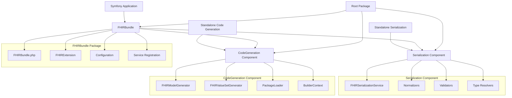
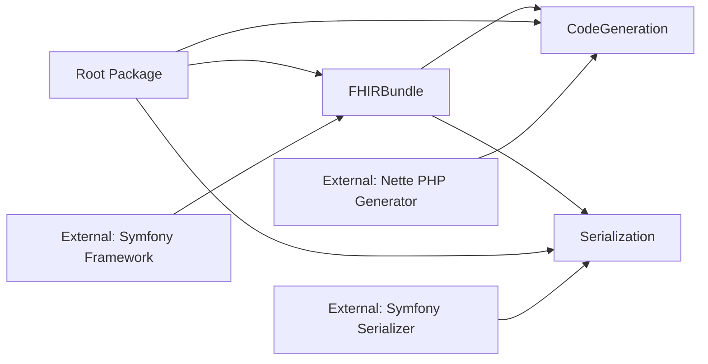

# PHP FHIRTools Multi-Project Architecture

## Overview

PHP FHIRTools has been reorganized into a multi-project format with separate packages for Bundle, CodeGeneration, and Serialization components. This architecture improves modularity, enables independent versioning, and provides better separation of concerns while maintaining backward compatibility.

## Architecture Diagram



## Directory Structure

```
php-fhir-tools/
├── src/
│   ├── Bundle/
│   │   └── FHIRBundle/                    # Symfony Bundle Package
│   │       ├── FHIRBundle.php
│   │       ├── DependencyInjection/
│   │       │   ├── FHIRExtension.php
│   │       │   ├── Configuration.php
│   │       │   └── Compiler/
│   │       ├── Resources/
│   │       │   └── config/
│   │       │       └── services.yaml
│   │       ├── composer.json
│   │       └── README.md
│   ├── Component/
│   │   ├── CodeGeneration/                # Code Generation Component
│   │   │   ├── src/
│   │   │   │   ├── Generator/
│   │   │   │   ├── Package/
│   │   │   │   ├── Context/
│   │   │   │   ├── Exception/
│   │   │   │   └── Service/
│   │   │   ├── tests/
│   │   │   ├── composer.json
│   │   │   └── README.md
│   │   └── Serialization/                 # Serialization Component
│   │       ├── src/
│   │       │   ├── Normalizer/
│   │       │   ├── Validator/
│   │       │   ├── Context/
│   │       │   ├── Exception/
│   │       │   └── Metadata/
│   │       ├── tests/
│   │       ├── composer.json
│   │       └── README.md
│   └── (legacy files for backward compatibility)
├── docs/
│   ├── architecture.md                    # This file
│   ├── migration-guide.md
│   └── component-guides/
│       ├── fhir-bundle.md
│       ├── code-generation.md
│       └── serialization.md
├── config/
│   └── recipes/
│       └── fhir-bundle/                   # Symfony Flex Recipe
└── composer.json                          # Root package
```

## Package Dependencies

### Dependency Graph



### Package Definitions

#### 1. FHIRBundle Package
- **Name**: `ardenexal/fhir-bundle`
- **Type**: `symfony-bundle`
- **Purpose**: Symfony Bundle integration for FHIR services
- **Dependencies**: 
  - `symfony/framework-bundle: ^6.4|^7.4`
  - `ardenexal/fhir-code-generation: ^1.0`
  - `ardenexal/fhir-serialization: ^1.0`

#### 2. CodeGeneration Component
- **Name**: `ardenexal/fhir-code-generation`
- **Type**: `library`
- **Purpose**: Standalone FHIR code generation
- **Dependencies**:
  - `nette/php-generator: ^4.2.0`
  - `composer/semver: ^3.4.4`

#### 3. Serialization Component
- **Name**: `ardenexal/fhir-serialization`
- **Type**: `library`
- **Purpose**: Standalone FHIR serialization and validation
- **Dependencies**:
  - `symfony/serializer: ^6.4|^7.4`
  - `symfony/validator: ^6.4|^7.4`

## Component Interfaces

### Service Interfaces

Each component defines clear interfaces for its functionality:

```php
// CodeGeneration Component
interface CodeGenerationServiceInterface
interface GeneratorInterface
interface PackageLoaderInterface
interface BuilderContextInterface

// Serialization Component
interface FHIRSerializationServiceInterface
interface FHIRNormalizerInterface
interface FHIRValidatorInterface
interface FHIRTypeResolverInterface
```

### Cross-Component Communication

Components communicate through well-defined interfaces:

1. **Bundle → CodeGeneration**: Service registration and configuration
2. **Bundle → Serialization**: Service registration and Symfony integration
3. **CodeGeneration ↔ Serialization**: Shared FHIR type definitions

## Backward Compatibility

### Class Aliases

The root package maintains backward compatibility through class aliases:

```php
// Legacy namespace → New namespace
class_alias(
    'Ardenexal\\FHIRTools\\Component\\CodeGeneration\\FHIRModelGenerator',
    'Ardenexal\\FHIRTools\\FHIRModelGenerator'
);

class_alias(
    'Ardenexal\\FHIRTools\\Component\\Serialization\\FHIRSerializationService',
    'Ardenexal\\FHIRTools\\Serialization\\FHIRSerializationService'
);
```

### Migration Path

1. **Phase 1**: Install new packages alongside existing code
2. **Phase 2**: Update imports to use new namespaces
3. **Phase 3**: Remove legacy aliases when ready

## Symfony Integration

### Bundle Registration

The FHIRBundle automatically registers all FHIR services:

```yaml
# config/packages/fhir.yaml
fhir:
    generation:
        output_directory: '%kernel.project_dir%/src/FHIR'
        base_namespace: 'App\\FHIR'
    serialization:
        strict_validation: true
        cache_metadata: true
```

### Service Configuration

Services are configured with proper dependency injection:

```yaml
# FHIRBundle/Resources/config/services.yaml
services:
    _defaults:
        autowire: true
        autoconfigure: true

    fhir.model_generator:
        class: Ardenexal\FHIRTools\Component\CodeGeneration\FHIRModelGenerator
        public: true

    fhir.serialization_service:
        class: Ardenexal\FHIRTools\Component\Serialization\FHIRSerializationService
        public: true
```

## Cross-Version Compatibility

### Symfony 6.4 and 7.4 Support

All components support both Symfony versions through:

1. **Version Ranges**: `^6.4|^7.4` in composer.json
2. **Feature Detection**: Runtime detection of available features
3. **Compatibility Layer**: Version-specific code paths where needed

### PHP 8.2+ Requirements

All components require PHP 8.2+ and use modern PHP features:

- Strict types (`declare(strict_types=1);`)
- Typed properties and return types
- Constructor property promotion
- Match expressions where appropriate

## Testing Strategy

### Component Testing

Each component has its own test suite:

```
tests/
├── Unit/
│   ├── Bundle/FHIRBundle/
│   ├── Component/CodeGeneration/
│   └── Component/Serialization/
├── Integration/
│   ├── CrossComponentIntegration/
│   └── SymfonyIntegration/
└── Property/
    ├── CodeGenerationProperties/
    └── SerializationProperties/
```

### Property-Based Testing

Universal properties are tested across all components:

- **Dependency Separation**: No circular dependencies
- **Interface Compliance**: All implementations follow interfaces
- **Backward Compatibility**: Legacy code continues to work
- **Cross-Version Support**: Components work with both Symfony versions

## Performance Considerations

### Component Loading

- **Lazy Loading**: Components load only when needed
- **Service Caching**: Symfony service container caching
- **Autoloading Optimization**: PSR-4 compliant autoloading

### Memory Management

- **Component Isolation**: Prevent memory leaks between components
- **Resource Sharing**: Efficient sharing of common resources
- **Garbage Collection**: Proper cleanup of large objects

## Security Considerations

### Package Security

- **Dependency Scanning**: Regular security audits
- **Minimal Dependencies**: Each component has minimal required dependencies
- **Version Pinning**: Lock file management for reproducible builds

### Runtime Security

- **Input Validation**: All components validate inputs
- **Error Handling**: Secure error messages without information disclosure
- **File System Security**: Safe file operations with proper permissions

## Development Workflow

### Multi-Package Development

1. **Component Development**: Develop each component independently
2. **Integration Testing**: Test components together
3. **Bundle Testing**: Test Symfony integration
4. **Backward Compatibility**: Verify legacy code works

### Release Management

1. **Component Versioning**: Independent semantic versioning
2. **Bundle Coordination**: Coordinate bundle releases with component updates
3. **Migration Support**: Provide migration tools and documentation

## Future Considerations

### Extensibility

The architecture supports future extensions:

- **New Components**: Additional components can be added
- **Plugin System**: Component-based plugin architecture
- **Third-Party Integration**: External packages can integrate with components

### Scalability

- **Horizontal Scaling**: Components can be deployed independently
- **Performance Optimization**: Component-specific optimizations
- **Resource Management**: Efficient resource utilization across components